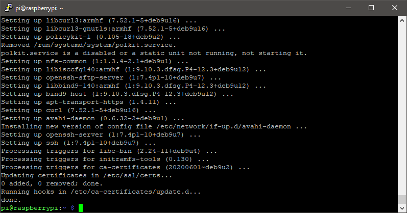
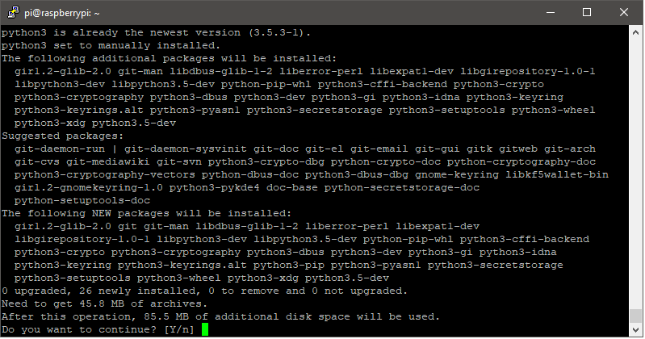
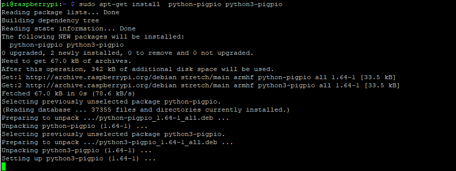
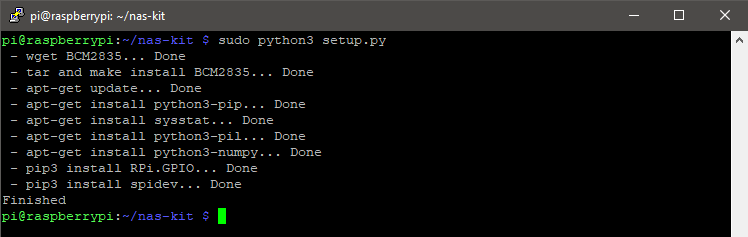

# raspberryPi
Descripcion de Pasos para configuracion RaspBerry Pi B+ 1.2 + SUNFounder NAS KIT

## Configuracion inicial
- A la memory card le grabo la imagen de 2018-10-09-raspbian-stretch-lite en una memory card de 32GB (De preferencia con buena tasa de I/O, buscar alguna marca ScanDisk Ultra o extreme)
- Loguearse, Usuario default pi/raspbian `sudo raspi-config`
  - Epandir el FS
  - Habilitar la interfaz GPIO, hacerlo desde el menu **raspi-config** o bien `sudo raspi-config nonint do_spi 0`
  - Debido a que la edicion *stretch-lite* ya es software legado por lo que el repositorio se movio de ubicacion, hay que editar: `sudo vi /etc/apt/sources.list` luego agregar la linea `deb http://legacy.raspbian.org/raspbian/ stretch main contrib non-free rpi`
- Armarse de paciencia para hacer actualizaciones ( Aproximadamente 20 minutos)
  - `sudo apt-get update`
  - `sudo apt-get upgrade`
  - 

## Instalar otras herramientas
Considera que debes tener estas python3 para poder usar GPIO en este proyecto `sudo apt-get install git python3 python3-pip`


## Habilitar GPIO
- En caso de no contar con los drivers para GPIO hay que instalarlos mediante `sudo apt-get install python-pigpio python3-pigpio` no olvidando al final habilitar la interfaz GPIO desde **raspi-config**


Estaba leyendo que NO se debe usar **Rpi.GPIO2** Ni tampoco **gpiod** por lo que deberas asegurar este punto:
`sudo pip3 uninstall Rpi.GPIO2 gpiod` y `pip3 uninstall Rpi.GPIO2 gpiod`

## Descargar e instalar el paquetes NAS - KIT [^1]
```
git clone --depth=1 https://github.com/sunfounder/nas-kit.git
cd nas-kit
sudo python3 setup.py
sudo cp ./bin/nas-kit.service /lib/systemd/system/nas-kit.service
sudo chmod +x /usr/bin/nas-kit
sudo systemctl daemon-reload
sudo systemctl enable nas-kit.service
sudo systemctl start nas-kit
```


Para corroborar que al menos el script funciona , ejecuta:
```
cd ~/nas-kit
python3 main/raspi_omv_main.py
```
> [!CAUTION]
> En caso de que el repositorio de nas-kit te diera problemas, prueba con varios workaround, por ejemplo:
> - Si se presentan error por conversion de string to float, prueba ajustando el locale a en_US

Despues del reinicio Puedes corroborar que servicios se encuentran activos con `systemctl -t service list-units --all`
> [!NOTE]
> Hacerlo bajo tus propio riesgo


## Referencias
[^1]: https://github.com/sunfounder/nas-kit

